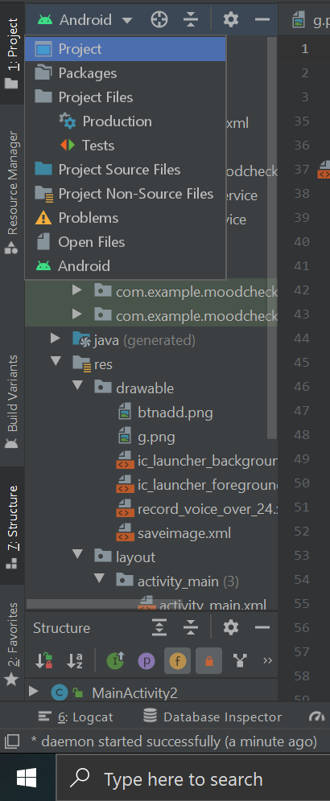

# how-to-save-android-sensor-data-
This is repository is all about how to save  android sensor data in phone's internal storage real-time data, so this would help every one

For store file in csv you need  opencsv-5.3.jar  in you android project( /libs/ copy and and paste this file ( opencsv-5.3.jar) ) this will add all the file.

#look at here how to switch in project 

#And then  go to libs folder in project mod in android studio

#Then after you're ready to go the dependency is automaticly added in your gredl.build file

#Take look at this image 

